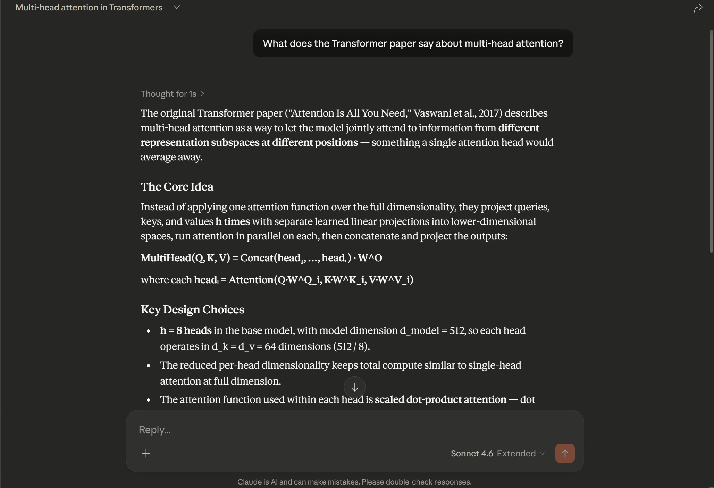
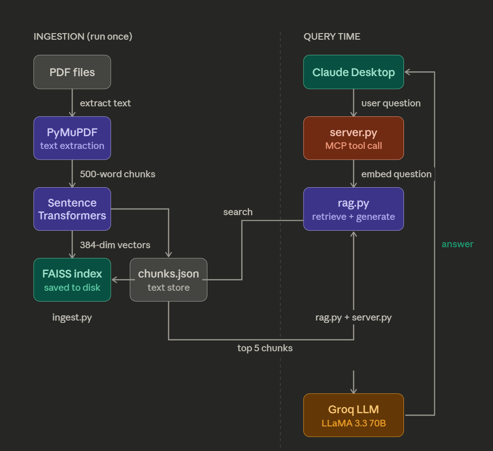
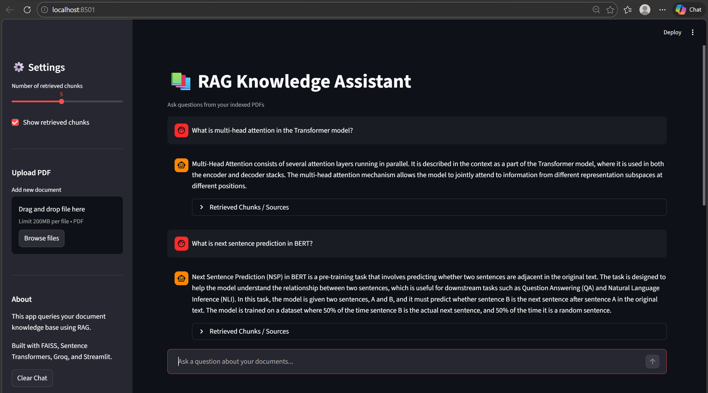
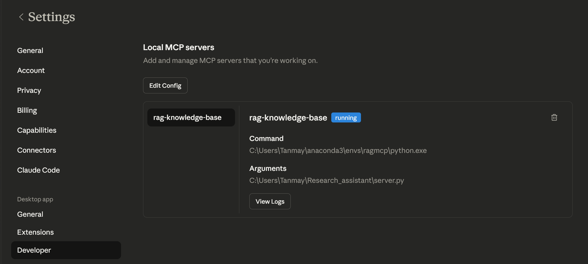

# RAG-Powered MCP Server for Document Q&A


A production-ready **Retrieval-Augmented Generation (RAG)** pipeline exposed as a **Model Context Protocol (MCP)** server — enabling Claude Desktop to answer questions directly from your private document collection.

Built with FAISS vector search, Sentence Transformers, and Groq LLM.


## Features

- Retrieval-Augmented Generation (RAG) pipeline
- FAISS vector similarity search
- Sentence Transformer embeddings
- Groq LLaMA inference for fast responses
- Streamlit chat interface
- Claude Desktop MCP integration
- Source-grounded answers (no hallucination)
- Adjustable retrieval depth

---

## What This Does

You feed it PDFs → it indexes them semantically → Claude Desktop can query them in real-time via MCP tool calls.

Ask Claude *"What does the Transformer paper say about multi-head attention?"* and it retrieves the exact relevant passages from your documents and generates a grounded answer — no hallucination, no guessing.

---

## Architecture


```
PDFs
  ↓  PyMuPDF extracts text
Text Chunks (500 words each)
  ↓  Sentence Transformers embeds
FAISS Index (local vector store)

--- At query time ---

User Question → Claude Desktop
  ↓  MCP tool call
server.py receives question
  ↓  embeds question
FAISS finds Top 5 similar chunks
  ↓  chunks stuffed into prompt
Groq LLaMA generates grounded answer
  ↓
Answer returned to Claude Desktop
```

---

## Tech Stack

| Component | Technology | Purpose |
|-----------|-----------|---------|
| PDF parsing | PyMuPDF | Extract raw text from PDFs |
| Embeddings | Sentence Transformers (all-MiniLM-L6-v2) | Convert text to semantic vectors |
| Vector store | FAISS (Meta) | Fast similarity search |
| LLM | Groq (LLaMA 3.3 70B) | Generate answers from retrieved chunks |
| MCP server | FastMCP (Python SDK) | Expose RAG as Claude Desktop tool |

---
## Streamlit Web Interface

The project also includes an interactive **Streamlit chat interface** that allows users to query their documents directly from a browser.

Features:

• Chat-style interface  
• Source-grounded answers  
• Adjustable retrieval depth  
• Retrieved document chunks inspection  

### Screenshot



---

## Project Structure

```
rag-mcp-server/
│
├── documents/              ← Put your PDFs here
│   ├── 1706.03762v7.pdf    (Attention Is All You Need)
│   ├── 1810.04805v2.pdf    (BERT)
│   └── 2005.11401v4.pdf    (RAG paper by Meta)
│
├── assets/                 
│   ├── demo.png            (Claude Desktop answering from papers)
│   ├── mcp_running.png     (MCP server running in Claude settings)
│   └── architecture.png    
│
├── ingest.pynb               ← Run once: chunks + embeds PDFs → FAISS index
├── rag.py                  ← Core RAG logic: retrieve + generate
├── server.py               ← MCP server: exposes RAG as Claude tool
│
├── chunks.json             ← Auto-generated by ingest.py
├── faiss_index.bin         ← Auto-generated by ingest.py
│
├── requirements.txt
└── README.md
├── streamlit_app.py       ← Streamlit web interface
```

---

## Setup

### 1. Clone the repo

```bash
git clone https://github.com/TanmayRawal/rag-mcp-server.git
cd rag-mcp-server
```

### 2. Create a Python 3.11 environment

```bash
conda create -n ragmcp python=3.11
conda activate ragmcp
```

### 3. Install dependencies

```bash
pip install -r requirements.txt
```

### 4. Get a free Groq API key

- Go to [console.groq.com](https://console.groq.com)
- Sign up and create an API key
- Add it to both `rag.py` and `server.py`:

```python
os.environ["GROQ_API_KEY"] = "your_key_here"
```

### 5. Add PDFs to `documents/`

Place any PDFs in the `documents/` folder. Suggested papers:
- [Attention Is All You Need](https://arxiv.org/pdf/1706.03762)
- [BERT](https://arxiv.org/pdf/1810.04805)
- [RAG paper by Meta](https://arxiv.org/pdf/2005.11401)

### 6. Run ingestion

```bash
python ingest.py
```

Reads all PDFs, splits into 500-word chunks, embeds with Sentence Transformers, saves FAISS index. Run once (or when you add new documents).

### 7. Test RAG directly

```bash
python rag.py
```

---

## Connecting to Claude Desktop


### 1. Edit the MCP config

- **Windows:** `C:\Users\<you>\AppData\Roaming\Claude\claude_desktop_config.json`
- **Mac:** `~/Library/Application Support/Claude/claude_desktop_config.json`

```json
{
  "mcpServers": {
    "rag-knowledge-base": {
      "command": "/path/to/conda/envs/ragmcp/python",
      "args": ["/path/to/rag-mcp-server/server.py"]
    }
  }
}


### 2. Restart Claude Desktop

Fully quit and reopen. Go to **Settings → Developer** — you should see `rag-knowledge-base` with status **running**.

### 3. Ask Claude anything about your documents

```
What does the Transformer paper say about multi-head attention?
What datasets were used to evaluate RAG?
Explain the BERT pre-training objectives.
```

Claude automatically calls your `query_knowledge_base` tool and answers from your actual documents.

---

## How RAG Works

1. **Retrieve** — embed the question, search FAISS for top 5 semantically similar chunks
2. **Augment** — inject those chunks into the LLM prompt as context
3. **Generate** — LLM reads chunks and generates a grounded answer

No fine-tuning. No training. Just smart search + generation.

---
## Example Questions

Try asking questions like:

- What does the Transformer paper say about multi-head attention?
- What are the pre-training objectives used in BERT?
- How does Retrieval Augmented Generation work?
- What datasets were used to evaluate the RAG model?

---


## Requirements

```
pymupdf
sentence-transformers
faiss-cpu
groq
mcp
```

Python 3.11+ required.

---

## Future Improvements

- Support more formats (`.txt`, `.docx`, `.md`)
- Hybrid search (BM25 + semantic)
- Conversation memory across queries
- Streamlit web UI
- Multiple independent knowledge bases

---

## License

MIT
